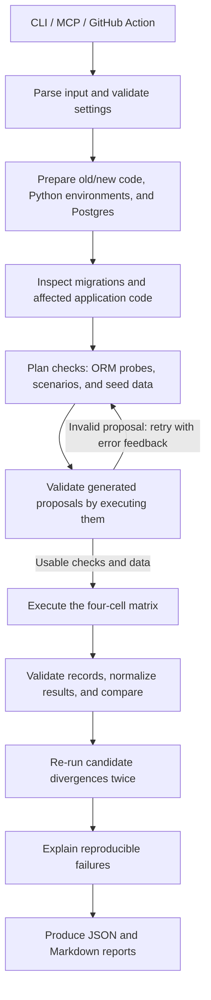

```mermaid
flowchart TD
    A["CLI / MCP / GitHub Action"] --> B["Parse input and validate settings"]
    B --> C["Prepare old/new code, Python environments, and Postgres"]
    C --> D["Inspect migrations and affected application code"]
    D --> E["Plan checks: ORM probes, scenarios, and seed data"]
    E --> F["Validate generated proposals by executing them"]
    F -->|Invalid proposal: retry with error feedback| E
    F -->|Usable checks and data| G["Execute the four-cell matrix"]
    G --> H["Validate records, normalize results, and compare"]
    H --> I["Re-run candidate divergences twice"]
    I --> J["Explain reproducible failures"]
    J --> K["Produce JSON and Markdown reports"]
```
